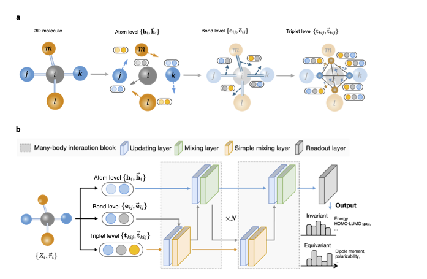

# ENINet

## Introduction

**ENINet** (Equivariant N-body Interaction Networks) is a deep learning architecture designed to improve molecular property predictions by integrating equivariant many-body interactions. Unlike traditional message passing networks, which may lose directional information due to opposing bond vectors, ENINet explicitly incorporates \( l = 1 \) equivariant interactions to retain and enhance directional symmetric information. This results in improved model accuracy for a wide range of scalar and tensorial quantum chemical properties.

<p align="center">
    
</p>
<p align="center">
    <b>Fig. 1:</b> (a) Molecular representations at multiple levels; (b) Model architecture.
</p>

For more details, refer to the [https://doi.org/10.48550/arXiv.2406.13265](https://doi.org/10.48550/arXiv.2406.13265).

## Environmental configuration

1. Create a virtual environment using Conda:
```
conda create -n eninet python=3.8
conda activate eninet
```

2. Install the specific `DGL` version used in this study:
```
wget https://anaconda.org/dglteam/dgl/2.0.0.cu117/download/linux-64/dgl-2.0.0.cu117-py38_0.tar.bz2
conda install dgl-2.0.0.cu117-py38_0.tar.bz2
```

3. Install the `eninet` package along with its required dependencies:
```
git clone https://github.com/tsudalab/ENINet.git
cd ENINet
pip install -e .
```

## Run Experiments

This repository provides code for training on benchmark datasets, including QM9, MD17, and QM7b polarizabilities. To run the training yourself, follow these steps:

```python
cd src/eninet/script
python train_qm9.py --config configs/qm9-example.yaml
python train_md17.py --config configs/md17-example.yaml
python train_qm7b.py --config configs/qm7b-example.yaml
```

## Custom Usage

### 1. Prepare a custom dataset

To prepare a custom dataset, save it as a JSON file with the following structure:

```
{
  "mol_id": {
    "structure": <structure>,
    "label": <label>
  }
}
```

You can use the following code snippet as an example to create and save a dataset:

```python
import json
from ase import Atoms
from monty.json import MontyEncoder
from ase.io import read

dataset = {}

for mol_id, (xyz_file, label) in enumerate(zip(xyz_files, labels), start=1):
    atoms = read(xyz_file, format="xyz")

    dataset[str(mol_id)] = {"structure": atoms.todict(), "label": label}

with open(output_filename, 'w') as json_file:
    json.dump(dataset, json_file, cls=MontyEncoder, indent=4)

print(f"Dataset saved to {output_filename}")
```

### 2. Train a model

To train a model, you need two files:
- A dataset saved in the `.json` format as shown above.
- A configuration file in `.yaml` format.

An example configuration file is provided in `assets/config_example.yaml`. Modify the `dataset_path` parameter to point to your prepared JSON dataset.

Once the configuration file is set up, you can start training the model by running:

```python
python example/train_example.py --config assets/config_example.yaml
```

### 3. Inference on new structures

After the model is trained, you can use it to predict properties for new structures. There are three ways to provide new structures:

**Create an inference dataset**
The new structures can be provided in three ways:

1. A JSON file in the format `{"mol_id": {"structure": <structure>}}`, similar to the training data but without the `label` key for each molecule. The predicted results will be saved in a CSV file with two columns: `mol_id` and `pred`.
2. An XYZ file containing multiple structures. The predicted results will be saved as a CSV file with two columns: `mol_id` and `pred`. The `mol_id` is generated from the chemical symbol of each molecule.
3. An XYZ file with a single structure. The predicted result will be printed directly.

For inference, you will need the following three files:
1. The configuration file used for training.
2. The structure file for inference (either in `.xyz` or `.json` format).
3. The checkpoint file saved during training, typically named `task_<task>`, where `<task>` is the name of your task defined in the training configuration file.

To perform inference, replace the file paths with your own and run the following command:

```python
python infer_example.py --config assets/config_example.yaml --ckpt assets/task-example-epoch=99-val_mae=0.774.ckpt --infer assets/qm9-infer-example.json
```